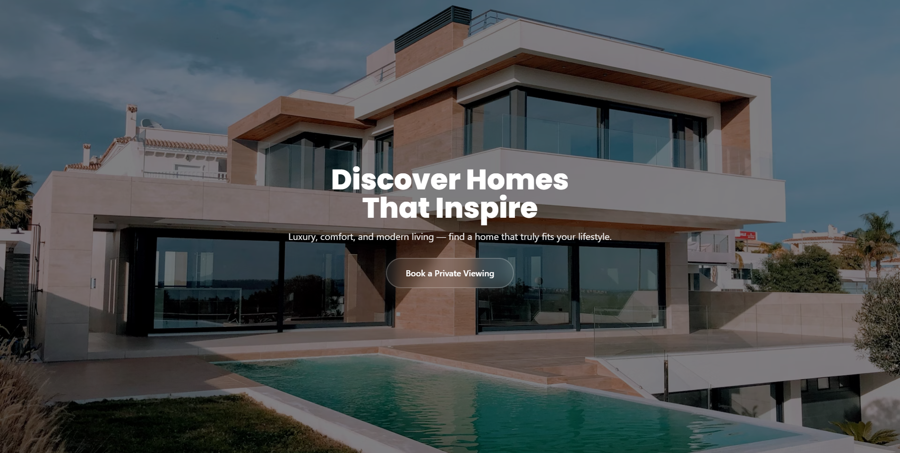

# DreamHome

A modern, high-converting real estate funnel landing template built with **Vanilla HTML, JavaScript, and TailwindCSS via CDN**, designed to showcase properties and capture leads effortlessly.



---

## Folder Structure

```
root/
├─ index.html
└─ thank-you/
   └─ index.html
```

---

## How to Run Locally

1. **Open a terminal** and navigate to the project folder:

2. **Start a local Python server**:

* **Python 3:**

```bash
python -m http.server 8000
```

* **Python 2:**

```bash
python -m SimpleHTTPServer 8000
```

3. **Open your browser** and go to:

```
http://localhost:8000/
```

---

## Features

* Sliders
* Parallax Hero
* Thank You Page
* Responsive